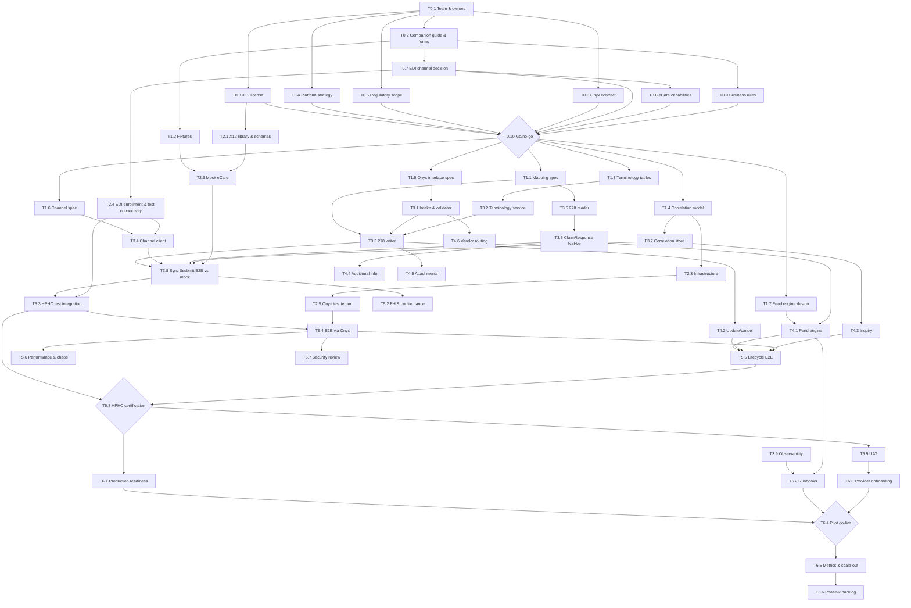

# 12 – Project Plan: Ordered Task List with Dependencies

No dates or durations. Tasks are numbered by phase and listed in execution order; "Depends on"
names the tasks that must be finished (or, where noted, started) first. Tasks with the same
dependencies can run in parallel. "Gate" marks a go/no-go decision. Owners: **Biz** business
sponsor / UM owners, **EDI** HPHC EDI team liaison, **eCare** eCare system owner/vendor, **Onyx**
vendor, **Bridge** bridge engineering team, **Arch** Point32Health architecture, **Sec**
security/compliance.

## Critical path

T0.1 → T0.2 → T0.7 → T0.8 → T0.10 (gate) → T1.1 → T3.3 / T3.5 → T3.8 → T5.3 → T5.8 (certification) → T6.1 → T6.4 (pilot go-live)

Long-lead items to start on day one because they sit beside the critical path: T0.3 (X12
license), T2.4 (EDI enrollment and test connectivity), T0.6 (Onyx integration contract).

## Phase 0 – Decisions and access

| ID | Task | Owner | Depends on |
|---|---|---|---|
| T0.1 | Name the project team and owners: business sponsor, EDI liaison, eCare owner, Onyx project manager, bridge tech lead, security/compliance contact. Agree the decision forum. | Biz | – |
| T0.2 | Obtain the HPHC 278 companion guide v1.2 PDF (and any newer version), the Tufts 278 guide, the EDI Enrollment and Set-Up forms and the Trade Partner Agreement; place them in `docs/fhir-278-bridge/reference/`. | EDI | T0.1 |
| T0.3 | Procure the X12 license (Glass subscription for 005010X217, 005010X215, 006020X316 and the X12/HL7 crosswalk); distribute code lists to the team under the license terms. | Arch | T0.1 |
| T0.4 | Confirm the platform strategy: eCare roadmap through 2028, Availity Essentials portal migration, the Availity + Onyx CMS-0057 platform, NEHEN FHIR participation, whether commercial UM moves to MHK. Record the answer as a design constraint. | Arch | T0.1 |
| T0.5 | Confirm regulatory scope and business driver: which HPHC commercial blocks are bound by CMS-0057-F, status of the HIPAA enforcement discretion, state decision clocks (MA 211 CMR 52.00, ME, NH, CT) to be enforced. | Sec / Biz | T0.1 |
| T0.6 | Agree the Onyx integration contract: back-end adapter pattern (synchronous call vs event), timeout Onyx can hold, API to update the current ClaimResponse for a Claim, how a subscription notification is triggered, `$inquire` delegation, PAS and US Core versions, OperationOutcome/HTTP conventions, where the full PAS bundle and documents are stored. | Onyx / Bridge | T0.1 |
| T0.7 | Decide the EDI channel: internal path into eCare vs the provider-facing gateway; which of HPHC's three production 278 options; enrollment model (universal submitter vs provider roster); envelope identifiers (ISA05–08, GS02/03, delimiters, character set, ISA14/TA1 election); test environment access. | EDI / Arch | T0.2 |
| T0.8 | Confirm eCare 278 capabilities: accepted UM01/UM02/UM03/UM04/UM06/UM09 values; required and ignored segments; maximum service lines; response segments returned (HCR02 vs REF*BB, REF*NT, DTP*AAH, HSD, MSG, HCR03, 2010EA/2010F); AAA codes emitted; pended-decision delivery mechanism (unsolicited response, X215 inquiry, event feed); edit/cancel shape (Appendices E and F); 275 support; idempotency rule; batch support; 999/TA1 behaviour. | EDI / eCare | T0.2, T0.7 |
| T0.9 | Business-rule decisions: how notifications (vs referrals vs prior authorizations) are represented over 278 and in a ClaimResponse; immutable-field policy for edits (reject vs auto cancel + new initial); delegated-vendor routing (Evolent, Carelon, EviCore, phone-only behavioral health); authorization number format and validity periods; urgency signalling; denial-reason source; retro-authorization rules; "no authorization required" outcome. | Biz / UM | T0.2 |
| T0.10 | **Gate**: go/no-go on the custom bridge and phase-1 scope freeze (supported request categories, service types, lines of business, lifecycle features deferred to phase 2). | Biz / Arch | T0.3, T0.4, T0.5, T0.6, T0.7, T0.8, T0.9 |

## Phase 1 – Specification

| ID | Task | Owner | Depends on |
|---|---|---|---|
| T1.1 | Transcribe the companion guide request/response tables into `04-mapping-request.md` and `05-mapping-response.md`; resolve every "CG ?" row; record defaults and rejection rules for X12-required elements without a FHIR source. | Bridge | T0.2, T0.3, T0.8 |
| T1.2 | Build the fixture set: companion guide Appendices A–F (request + response), X12 public X217 examples, PAS IG examples, synthetic negative cases (AAA at each level, 999 reject, TA1 reject, timeout, duplicate). | Bridge | T0.2 |
| T1.3 | Define terminology tables: ICD-10-CM formatting, CPT/HCPCS → `HC`, NDC policy, POS/type-of-bill → UM04, NUBC revenue codes, UCUM → X12 units, CPT/HCPCS → service type (UM03) default map, taxonomy, text folding and length limits. | Bridge / UM | T0.3, T0.8, T0.9 |
| T1.4 | Design the correlation data model and state machines: request and item states; identifiers (Bundle id, Claim id, BHT03, ISA13/GS06/ST02, 2000E/2000F TRN, authorization number, REF*NT); ClaimResponse versioning with a "current" pointer; retention. | Bridge | T0.6, T0.8 |
| T1.5 | Write the Onyx ↔ bridge interface specification (OpenAPI): submit, update/cancel, inquire, response push, error contract (OperationOutcome 4xx vs 5xx), idempotency keys. | Bridge / Onyx | T0.6 |
| T1.6 | Write the EDI channel specification: CORE SOAP/MIME envelope, control-number management, TA1/999 handling (in-band vs late), timeouts, retries, batch fallback if supported. | Bridge / EDI | T0.7, T0.8 |
| T1.7 | Design the pended-decision engine: chosen delivery mechanism, polling/back-off policy if inquiry-based, reconciliation of late 999s and unsolicited responses, subscription trigger to Onyx. | Bridge | T0.6, T0.8 |
| T1.8 | Security and privacy design: mTLS/TLS to eCare and Onyx, encryption at rest, PHI-safe logging and OperationOutcome text, audit retention, access model. | Sec / Bridge | T0.7 |
| T1.9 | Non-functional requirements and capacity plan: expected PA volumes (from HPHC PA metrics), peak rates, latency budget (≤ 12 s at the bridge), availability targets, behaviour when eCare is down. | Bridge / Biz | T0.5 |
| T1.10 | Test and certification plan: test pyramid, fixture ownership, Inferno PAS suites, HPHC EDI certification steps and sign-off criteria, UAT scope. | Bridge / EDI | T1.1, T1.2, T1.4, T1.5, T1.6, T1.7 |

## Phase 2 – Environments and tooling

| ID | Task | Owner | Depends on |
|---|---|---|---|
| T2.1 | Select the X12 library and load the 005010X217 (and X215) schemas; enable SNIP-level validation of outbound and inbound transactions. | Bridge | T0.3 |
| T2.2 | Set up FHIR validation tooling: HL7 validator with the PAS package, Inferno PAS client and server suites in CI. | Bridge | T0.6 |
| T2.3 | Stand up development and test infrastructure: repository, CI/CD, environments, secrets management, correlation database, raw-message store, monitoring stack. | Bridge | T1.4, T1.8 |
| T2.4 | Execute EDI enrollment: submitter ID, Trade Partner Agreement, certificates, connectivity to the HPHC test gateway, test member and provider identifiers. | EDI / Bridge | T0.7 |
| T2.5 | Connect the Onyx non-production tenant to the bridge development environment. | Onyx / Bridge | T0.6, T2.3 |
| T2.6 | Build a mock eCare that replays the fixture responses (including delayed unsolicited responses and AAA cases) for CI. | Bridge | T1.2, T2.1 |

## Phase 3 – Build: initial request and response

| ID | Task | Owner | Depends on |
|---|---|---|---|
| T3.1 | Intake adapter, bundle normalizer (reference resolution, de-duplication) and pre-flight validator returning OperationOutcome. | Bridge | T1.5, T2.2, T2.3 |
| T3.2 | Terminology service with versioned mapping tables and miss logging. | Bridge | T1.3, T2.3 |
| T3.3 | 278 request writer: envelope, HL hierarchy, loops 2000A–2010F, PWK/MSG, schema validation before send. | Bridge | T1.1, T2.1, T3.1, T3.2 |
| T3.4 | EDI channel client: real-time transport, durable control numbers, TA1/999 capture, timeout and retry behaviour. | Bridge | T1.6, T2.4 |
| T3.5 | 278 response reader: parse and validate, extract HCR/REF/DTP/HSD/MSG/AAA/PWK per level, tolerate companion-guide omissions. | Bridge | T1.1, T2.1 |
| T3.6 | ClaimResponse builder: item sequence restoration, reviewAction, authorization numbers, periods, authorized providers, item + addItem for A6, errors from AAA, processNote from MSG, CommunicationRequest from PWK/LOINC, echoed resources. | Bridge | T1.4, T3.5 |
| T3.7 | Correlation store implementation (states, identifiers, raw payloads, ClaimResponse versions). | Bridge | T1.4, T2.3 |
| T3.8 | Synchronous `$submit` end to end for initial requests against the mock eCare, including timeout → pended behaviour. | Bridge | T2.6, T3.1, T3.2, T3.3, T3.4, T3.5, T3.6, T3.7 |
| T3.9 | Observability and metrics: structured logs (PHI-safe), traces, PAS metric model, fields needed for CMS public reporting, dashboards and alerts. | Bridge | T3.7 |

## Phase 4 – Build: lifecycle features

| ID | Task | Owner | Depends on |
|---|---|---|---|
| T4.1 | Pended-decision engine: intake of unsolicited 278 responses and/or X215 polling and/or eCare event feed; ClaimResponse re-build and versioning; notification call to Onyx. | Bridge | T0.6, T1.7, T3.6, T3.7 |
| T4.2 | Update and cancel handler: Claim Update flags → UM02 S/4/3 with REF*BB/REF*NT; immutable-field policy; denied-request guard. | Bridge | T0.9, T3.3, T3.7 |
| T4.3 | Inquiry handler: `$inquire` → X215 or correlation-store lookup with "current response for superseded reference number" rule. | Bridge | T0.8, T3.7 |
| T4.4 | Additional-information requests: PWK01/LOINC/questionnaire TRN → CommunicationRequest and Task inputs; linkage to CDex `$submit-attachment`. | Bridge / Onyx | T3.6 |
| T4.5 | Attachments: 275 writer with PWK06 control-number continuity, or document intake keyed by authorization number, per T0.8. | Bridge / eCare | T0.8, T3.3 |
| T4.6 | Delegated-vendor routing and "no authorization required" handling (CT / NA responses with contact information). | Bridge / UM | T0.9, T3.1 |
| T4.7 | Batch and resubmission fallback (only if batch is supported). | Bridge | T0.8, T3.4 |

## Phase 5 – Verification and certification

| ID | Task | Owner | Depends on |
|---|---|---|---|
| T5.1 | Unit and golden-file tests for writer, reader, terminology and builder against the fixture set; CI gate. | Bridge | T1.2, T3.3, T3.5, T3.6 |
| T5.2 | FHIR conformance: validator clean on all request/response bundles; Inferno PAS server suite passing for the supported scope, exceptions documented. | Bridge | T2.2, T3.8 |
| T5.3 | HPHC test-environment integration tests: each Appendix A–F scenario accepted with the expected HCR; negative tests return the documented AAA; TA1/999 paths; latency measured. | Bridge / EDI | T2.4, T3.8 |
| T5.4 | End-to-end through Onyx: EHR sandbox or Inferno client → Onyx test tenant → bridge → HPHC test → ClaimResponse back. | Bridge / Onyx | T2.5, T5.3 |
| T5.5 | Lifecycle end-to-end: pended → final via subscription notification; update; cancel; inquiry; additional-information request. | Bridge / Onyx | T4.1, T4.2, T4.3, T4.4, T5.4 |
| T5.6 | Performance, failover and chaos testing (eCare down, slow responses, duplicate submissions, control-number recovery). | Bridge | T5.4 |
| T5.7 | Security review, PHI logging audit and penetration test. | Sec | T1.8, T5.4 |
| T5.8 | **Gate**: HPHC EDI certification sign-off for the 278 trading partner. | EDI | T5.3, T5.5 |
| T5.9 | UAT with UM staff (what eCare users see) and pilot providers/EHR vendors. | Biz / UM | T5.5, T5.8 |

## Phase 6 – Go-live and operations

| ID | Task | Owner | Depends on |
|---|---|---|---|
| T6.1 | Production readiness: production submitter ID and envelope values (ISA15 = P), production Onyx tenant, certificates, cut-over and rollback plan. | Bridge / EDI / Onyx | T5.8 |
| T6.2 | Runbooks and on-call: control-number recovery, replay of a submission, open-pend reconciliation report, stale-authorization handling, escalation to EDI team. | Bridge | T3.9, T4.1 |
| T6.3 | Provider and EHR onboarding with Onyx: endpoint registration, subscription setup, supported-scope communication, support channel. | Onyx / Biz | T5.9 |
| T6.4 | **Gate**: pilot go-live with a limited set of providers and service categories; hypercare period; defect triage. | Biz / Bridge | T6.1, T6.2, T6.3 |
| T6.5 | Metrics review and CMS public-reporting feed; scale to the full commercial line. | Biz / Bridge | T6.4 |
| T6.6 | Phase-2 backlog grooming: dental (SV3), phone-only behavioral health services, other lines of business served by eCare, NEHEN FHIR / Availity alignment, CRD/DTR questionnaire coverage to reduce pends. | Biz / Arch | T6.5 |

## Dependency diagram

